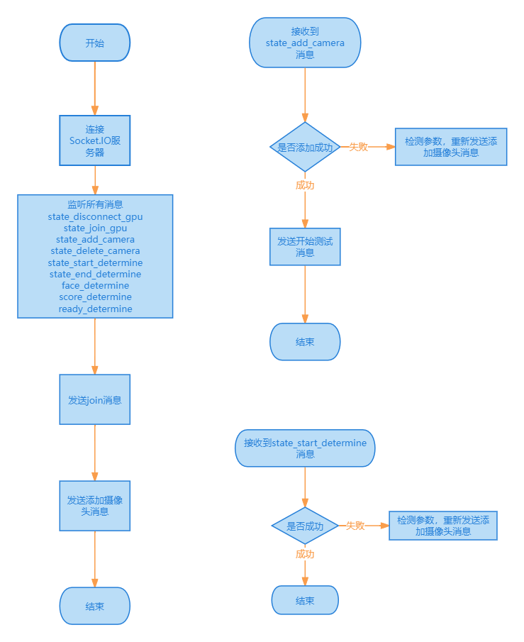

# 立定跳远服务调用使用文档

## 目录
1. [安装](#1-安装)
2. [连接 Socket.IO 服务器](#2-连接-socketio-服务器)
3. [发送消息](#3-发送消息)
   1. [join](#31-join)
   2. [ camera](#32-camera)
      1. [添加摄像头](#321-添加摄像头)
      2. [删除摄像头](#322-删除摄像头)
   3. [determine](#33-determine)
      1. [开始测试](#331-开始测试)
      2. [结束测试](#332-结束测试)
      3. [用户识别成功](#333-用户识别成功)
      4. [用户识别失败](#334-用户识别失败)
4. [监听消息](#4-监听消息)
   1. [state_disconnect_gpu](#41-state_disconnect_gpu)
   2. [state_join_gpu](#42-state_join_gpu)
   3. [state_add_camera](#43-state_add_camera)
   4. [state_delete_camera](#44-state_delete_camera)
   5. [state_start_determine](#45-state_start_determine)
   6. [state_end_determine](#46-state_end_determine)
   7. [face_determine](#47-face_determine)
   8. [score_determine](#48-score_determine)
   9. [ready_determine](#49-ready_determine)
  
## 0 流程图




## 1 安装

首先，安装 Socket.IO 客户端库，具体安装方式取决于您选择的编程语言：

- **JavaScript**: 使用 [socket.io-client](https://github.com/socketio/socket.io-client) 库。
- **Java**: 可以使用 [socket.io-client-java](https://github.com/socketio/socket.io-client-java) 库。
- **C++**: 使用 [socket.io-client-cpp](https://github.com/socketio/socket.io-client-cpp) 库。
- **Swift**: 可以使用 [socket.io-client-swift](https://github.com/socketio/socket.io-client-swift) 库。
- **Dart**: 使用 [socket.io-client-dart](https://github.com/rikulo/socket.io-client-dart) 库。
- **Python**: 可以使用 [python-socketio](https://github.com/miguelgrinberg/python-socketio) 库。
- **.NET**: 使用 [socket.io-client-csharp](https://github.com/doghappy/socket.io-client-csharp) 库。
- **Rust**: 可以使用 [rust-socketio](https://github.com/1c3t3a/rust-socketio) 库。
- **PHP**: 使用 [elephant.io](https://github.com/ElephantIO/elephant.io) 库。

## 2 连接 Socket.IO 服务器

在代码中，使用 Socket.IO 客户端库连接到服务的地址，例如：

```javascript
const io = require('socket.io-client');
const socket = io('https://gs.classtao.cn/yintixiangshang');
```

## 3 发送消息

客户端可以向服务器发送以下类型的消息，每种消息类型都有其特定的作用和参数要求。

### 3.1 join

**作用：** 发送加入房间的消息。

**参数字段说明：**

| 参数字段   | 类型           | 说明                                       |
|------------|----------------|--------------------------------------------|
| roomId     | 字符串 (String)| 房间的唯一标识符。                        |

**参数示例：**
```json
{
  "roomId":"random_room_id"
}
```

### 3.2 camera

**作用：** 发送摄像头相关操作的消息。

#### 3.2.1 添加摄像头

**参数字段说明：**

| 参数字段   | 类型           | 说明                                       |
|------------|----------------|--------------------------------------------|
| action     | 字符串 (String)| 操作类型，可以是 "add"（添加）或其他自定义操作。|
| roomId     | 字符串 (String)| 房间的唯一标识符。                        |
| name       | 字符串 (String)| 摄像头名称。                               |
| cameraId   | 字符串 (String)| 摄像头的唯一标识符。                      |
| host       | 字符串 (String)| 摄像头的主机地址。                        |
| channel    | 字符串 (String)| 摄像头的通道。                            |
| username   | 字符串 (String)| 登录摄像头的用户名。                      |
| password   | 字符串 (String)| 登录摄像头的密码。                        |
| rtspuser   | 字符串 (String) 或 null | RTSP 用户名（如果适用）。          |
| rtsppswd   | 字符串 (String) 或 null | RTSP 密码（如果适用）。            |
| face       | 字符串 (String) 或 null | 是否开启人脸识别，有值表示开启。    |
| mark       | 数组 (Array)   | 标记点的坐标数组。                        |

**参数示例：**
```json
{
  "action": "add",
  "roomId": "random_room_id",
  "name": "公司一",
  "cameraId": "de40c000-c2d6-11b2-80d2-bc5e33ace640",
  "host": "192.168.31.142",
  "channel": "1",
  "username": "username",
  "password": "password",
  "rtspuser": "rtspuser",
  "rtsppswd": "rtsppswd",
  "mark": [[1585,733],[1648,1033],[1353,735],[1400,1034],[1130,736],[1143,1046],[896,739],[880,1046],[666,737],[618,1045],[439,735],[363,1038]]
}

```

**JavaScript例子：**
```javascript
  // 添加摄像头
  socket.emit("camera", {
    "action": "add",
    "roomId": "random_room_id",
    "name": "公司一",
    "cameraId": "de40c000-c2d6-11b2-80d2-bc5e33ace640",
    "host": "192.168.31.142",
    "channel": "1",
    "username": "username",
    "password": "password",
    "rtspuser": "rtspuser",
    "rtsppswd": "rtsppswd",
    "mark": [[1585,733],[1648,1033],[1353,735],[1400,1034],[1130,736],[1143,1046],[896,739],[880,1046],[666,737],[618,1045],[439,735],[363,1038]]
  });

```

#### 3.2.1 删除摄像头

**参数字段说明：**

| 参数字段   | 类型           | 说明                                       |
|------------|----------------|--------------------------------------------|
| action     | 字符串 (String)| 操作类型，通常为 "delete"。                |
| roomId     | 字符串 (String)| 房间的唯一标识符。                        |
| cameraId   | 字符串 (String)| 摄像头的唯一标识符。                      |

**参数示例：**
```json
{
  "action":"delete",
  "roomId":"random_room_id",
  "cameraId":"de40c000-c2d6-11b2-80d2-bc5e33ace640"
}
```

**JavaScript例子：**
```javascript
  // 添加摄像头
  socket.emit("camera", {
    "action": "delete",
    "roomId": "random_room_id",
    "cameraId": "de40c000-c2d6-11b2-80d2-bc5e33ace640",
  });
```

### 3.3 determine

**作用：** 发送人脸识别相关的消息，包括开始人脸识别和人脸识别结果。

#### 3.3.1 开始测试

**参数字段说明：**

| 参数字段   | 类型           | 说明                                       |
|------------|----------------|--------------------------------------------|
| roomId     | 字符串 (String)| 房间的唯一标识符。                        |
| action     | 字符串 (String)| 操作类型，通常为 "start"。                 |
| cameraId   | 字符串 (String)| 摄像头的唯一标识符。                      |

**参数示例（开始测试）：**
```json
{
  "roomId": "random_room_id",
  "action": "start",
  "cameraId": "de40c000-c2d6-11b2-80d2-bc5e33ace640"
}
```

**JavaScript例子：**
```javascript
  // 添加摄像头
  socket.emit("determine", {
    "action": "start",
    "roomId": "random_room_id",
    "cameraId": "de40c000-c2d6-11b2-80d2-bc5e33ace640",
  });
```

#### 3.3.2 结束测试

**参数字段说明：**

| 参数字段   | 类型           | 说明                                       |
|------------|----------------|--------------------------------------------|
| roomId     | 字符串 (String)| 房间的唯一标识符。                        |
| action     | 字符串 (String)| 操作类型，通常为 "end"。                   |
| cameraId   | 字符串 (String)| 摄像头的唯一标识符。                      |

**参数示例（结束测试）：**
```json
{
  "roomId":"random_room_id",
  "action":"end",
  "cameraId":"de40c000-c2d6-11b2-80d2-bc5e33ace640"
}
```

**JavaScript例子：**
```javascript
  // 添加摄像头
  socket.emit("determine", {
    "action": "end",
    "roomId": "random_room_id",
    "cameraId": "de40c000-c2d6-11b2-80d2-bc5e33ace640",
  });
```

#### 3.3.3 用户识别成功

**参数字段说明：**

| 参数字段   | 类型           | 说明                                       |
|------------|----------------|--------------------------------------------|
| action     | 字符串 (String)| 操作类型，通常为 "user"。                 |
| roomId     | 字符串 (String)| 房间的唯一标识符。                        |
| cameraId   | 字符串 (String)| 摄像头的唯一标识符。                      |
| data       | 对象 (Object)  | 包含人脸识别失败的相关信息。               |
| data.state | 字符串 (String)| 状态，可以是 "fail"（失败）。             |

**参数示例（人脸识别成功）：**
```json
{
  "action":"user",
  "roomId":"random_room_id",
  "cameraId":"de40c000-c2d6-11b2-80d2-bc5e33ace640",
  "data":{
    "state":"success",
    "name":"黄晓旭",
    "id":"sdf32d2d2d2323d223"
  }
}
```

**JavaScript例子：**
```javascript
  // 人脸识别成功
  socket.emit("determine", {
    "action":"user",
    "roomId":"random_room_id",
    "cameraId":"de40c000-c2d6-11b2-80d2-bc5e33ace640",
    "data":{
       "state":"success",
       "name":"黄晓旭",
       "id":"sdf32d2d2d2323d223"
    }
  });
```


#### 3.3.3 用户识别失败

**参数字段说明：**

| 参数字段   | 类型           | 说明                                       |
|------------|----------------|--------------------------------------------|
| action     | 字符串 (String)| 操作类型，通常为 "user"。                 |
| roomId     | 字符串 (String)| 房间的唯一标识符。                        |
| cameraId   | 字符串 (String)| 摄像头的唯一标识符。                      |
| data       | 对象 (Object)  | 包含人脸识别成功的相关信息。               |
| data.state | 字符串 (String)| 状态，可以是 "success"（成功）。          |
| data.name  | 字符串 (String)| 识别到的人员姓名。                         |
| data.id    | 字符串 (String)| 识别到的人员标识符。                       |

**参数示例（人脸识别失败）：**
```json
{
  "action":"user",
  "roomId":"random_room_id",
  "cameraId":"de40c000-c2d6-11b2-80d2-bc5e33ace640",
  "data":{
    "state":"fail"
  }
}
```

**JavaScript例子：**
```javascript
  // 人脸识别失败
  socket.emit("determine", {
    "action":"user",
    "roomId":"random_room_id",
    "cameraId":"de40c000-c2d6-11b2-80d2-bc5e33ace640",
    "data":{
        "state":"fail"
    }
  });
```

## 4. 监听消息

客户端可以监听以下类型的消息，以获取服务器发送的状态更新或结果信息。

### 4.1 state_disconnect_gpu

**作用：** GPU掉线状态更新。

**参数字段说明：**

| 参数字段   | 类型           | 说明                                       |
|------------|----------------|--------------------------------------------|
| roomId     | 字符串 (String)| 房间的唯一标识符。                         |
| message    | 字符串 (String)| 控制消息。                                 |

**参数示例：**
```json
{
  "roomId": "random_room_id",
  "message": "掉线了"
}
```

### 4.2 state_join_gpu

**作用：** GPU上线状态更新。

**参数字段说明：**

| 参数字段   | 类型           | 说明                                       |
|------------|----------------|--------------------------------------------|
| roomId     | 字符串 (String)| 房间的唯一标识符。                         |
| message    | 字符串 (String)| 控制消息。                                 |

**参数示例：**
```json
{
  "roomId": "random_room_id",
  "message": "上线了"
}
```

### 4.3 state_add_camera

**作用：** 监听摄像头添加状态的消息。

**参数字段说明：**

| 参数字段   | 类型           | 说明                                       |
|------------|----------------|--------------------------------------------|
| action     | 字符串 (String)| 操作类型，通常为 "state_add"。            |
| state      | 字符串 (String)| 状态，可以是 "success"（成功）或 "fail"（失败）。|
| message    | 字符串 (String) 或 null | 消息，只在状态为 "fail" 时存在。     |
| id         | 字符串 (String)| 摄像头的唯一标识符。                      |
| roomId     | 字符串 (String)| 房间的唯一标识符。                        |

**参数示例（成功）：**
```json
{
  "action": "state_add",
  "id": "de40c000-c2d6-11b2-80d2-bc5e33ace640",
  "state": "success",
  "roomId": "random_room_id"
}
```

**参数示例（失败）：**
```json
{
  "action":"state_delete",
  "id":"de40c000-c2d6-11b2-80d2-bc5e33ace640",
  "state":"fail",
  "message":"没有找到对应的摄像头",
  "roomId":"random_room_id"
}
```

### 4.4 state_delete_camera

**作用：** 监听摄像头删除状态的消息。

**参数字段说明：**

| 参数字段   | 类型           | 说明                                       |
|------------|----------------|--------------------------------------------|
| action     | 字符串 (String)| 操作类型，通常为 "state_delete"。          |
| state      | 字符串 (String)| 状态，可以是 "success"（成功）或 "fail"（失败）。|
| message    | 字符串 (String) 或 null | 消息，只在状态为 "fail" 时存在。     |
| id         | 字符串 (String)| 摄像头的唯一标识符。                      |
| roomId     | 字符串 (String)| 房间的唯一标识符。                        |

**参数示例（成功）：**
- 
```json
{
  "action":"state_delete",
  "id":"de40c000-c2d6-11b2-80d2-bc5e33ace640",
  "state":"success",
  "roomId":"random_room_id"
}
```

**参数示例（失败）：**
- 
```json
{
  "action":"state_delete",
  "id":"de40c000-c2d6-11b2-80d2-bc5e33ace640",
  "state":"fail",
  "message":"没有找到对应的摄像头",
  "roomId":"random_room_id"
}
```

### 4.5 state_start_determine

**作用：** 监听分析开始状态的消息。

**参数字段说明：**

| 参数字段   | 类型           | 说明                                       |
|------------|----------------|--------------------------------------------|
| action     | 字符串 (String)| 操作类型，通常为 "state_start"。          |
| state      | 字符串 (String)| 状态，可以是 "success"（成功）或 "fail"（失败）。|
| message    | 字符串 (String) 或 null | 消息，只在状态为 "fail" 时存在。     |
| id         | 字符串 (String)| 摄像头的唯一标识符。                      |
| roomId     | 字符串 (String)| 房间的唯一标识符。                        |

**参数示例（成功）：**
```json
{
  "action": "state_start",
  "state": "success",
  "id": "de40c000-c2d6-11b2-80d2-bc5e33ace640",
  "roomId": "random_room_id"
}
```

**参数示例（失败）：**
```json
{
  "action": "state_start",
  "state": "fail",
  "id": "de40c000-c2d6-11b2-80d2-bc5e33ace640",
  "roomId": "random_room_id", 
  "message":"没有找到对应的摄像头"
}
```

### 4.6 state_end_determine

**作用：** 监听分析结束状态的消息。

**参数字段说明：**

| 参数字段   | 类型           | 说明                                       |
|------------|----------------|--------------------------------------------|
| action     | 字符串 (String)| 操作类型，通常为 "state_end"。             |
| state      | 字符串 (String)| 状态，可以是 "success"（成功）或 "fail"（失败）。|
| message    | 字符串 (String) 或 null | 消息，只在状态为 "fail" 时存在。     |
| id         | 字符串 (String)| 摄像头的唯一标识符。                      |
| roomId     | 字符串 (String)| 房间的唯一标识符。                        |

**参数示例（成功）：**
```json
{
  "action": "state_end",
  "state": "success",
  "id": "de40c000-c2d6-11b2-80d2-bc5e33ace640",
  "roomId": "random_room_id"
}
```

**参数示例（失败）：**
```json
{
  "action":"state_end",
  "state":"fail",
  "message":"摄像头不存在",
  "roomId":"random_room_id"
}
```

### 4.7 face_determine

**作用：** 监听获取参试人员人脸截图。

**参数字段说明：**

| 参数字段   | 类型          | 说明                                       |
|------------|---------------|--------------------------------------------|
| action     | 字符串 (String) | 操作类型，通常为 "face"。                   |
| data       | 字符串 (String) | 人脸图像的 Base64 编码数据。               |
| id         | 字符串 (String) | 摄像头的唯一标识符。                       |
| roomId     | 字符串 (String) | 房间的唯一标识符。                         |

**参数示例：**
```json
{
  "action": "face",
  "data": "data:image/jpeg;base64,/9j/4AAQSkZJRgABAQAAAQABAAD/2wBDAAIBAK9T//Z",
  "id": "de40c000-c2d6-11b2-80d2-bc5e33ace640",
  "roomId": "random_room_id"
}
```

### 4.8 score_determine

**作用：** 监听评分信息。

**参数字段说明：**

| 参数字段            | 类型           | 说明                                       |
|---------------------|----------------|--------------------------------------------|
| action              | 字符串 (String) | 操作类型，通常为 "score"。                  |
| sid                 | 字符串 (String) | 摄像头的唯一会话标识符。                   |
| message             | 字符串 (String) | 消息类型，通常为 "end" 表示结束。           |
| data                | JSON           | 评分相关数据的 JSON 对象。                 |
| data.id             | 字符串 (String) | 摄像头的唯一标识符。                       |
| data.distance      | 浮点数 (Float) | 距离（厘米）。                             |
| data.speed          | 浮点数 (Float) | 速度（米/秒）。                            |
| data.time           | 整数 (Integer) | 时间（秒）。                               |
| data.swing_arm_angle | 整数 (Integer) | 摆臂角度（度）。                          |
| data.waist_angle    | 整数 (Integer) | 腰部角度（度）。                           |
| data.knee_angle     | 整数 (Integer) | 膝盖角度（度）。                           |
| data.jump_height    | 整数 (Integer) | 跳跃高度（厘米）。                         |
| data.takeoff_angle  | 整数 (Integer) | 起跳角度（度）。                           |
| data.takeoff_thigh_angle | 整数 (Integer) | 起跳时大腿的角度（度）。                |
| data.takeoff_shank_angle | 整数 (Integer) | 起跳时小腿的角度（度）。                |
| data.double_takeoff | 布尔值 (Boolean) | 是否双脚起跳。                           |
| data.double_down    | 布尔值 (Boolean) | 是否双脚着地。                           |
| data.fall_down    | 布尔值 (Boolean) | 是否向后摔倒。                           |
| data.frames         | 数组 (Array)   | 图像帧数组。                               |
| data.video          | 字符串 (String) | 视频链接。                                 |
| id                  | 字符串 (String) | 摄像头的唯一标识符。                       |
| roomId              | 字符串 (String) | 房间的唯一标识符。                         |

**参数示例：**
```json
{
  "action": "score",
  "sid": "de40c000-c2d6-11b2-80d2-bc5e33ace640",
  "message": "end",
  "data": {
    "id": "de40c000-c2d6-11b2-80d2-bc5e33ace640",
    "distance": 169.02,
    "speed": 0.1878,
    "time": 900,
    "swing_arm_angle": 67,
    "waist_angle": 117,
    "knee_angle": 166,
    "jump_height": 272,
    "takeoff_angle": 54,
    "takeoff_thigh_angle": 58,
    "takeoff_shank_angle": 50,
    "double_takeoff": true,
    "double_down": true,
    "fall_down": False,
    "frames": [
      "https://zhihuicaochang.oss-cn-hangzhou.aliyuncs.com/tiaoyuan/cca08c161ac025ded2fdf6370783ac14_begin1715670689422.jpg",
      "https://zhihuicaochang.oss-cn-hangzhou.aliyuncs.com/tiaoyuan/cca08c161ac025ded2fdf6370783ac14_start1715670689615.jpg",
      "https://zhihuicaochang.oss-cn-hangzhou.aliyuncs.com/tiaoyuan/cca08c161ac025ded2fdf6370783ac14_heighest1715670689703.jpg",
      "https://zhihuicaochang.oss-cn-hangzhou.aliyuncs.com/tiaoyuan/cca08c161ac025ded2fdf6370783ac14_down1715670689827.jpg",
      "https://zhihuicaochang.oss-cn-hangzhou.aliyuncs.com/tiaoyuan/cca08c161ac025ded2fdf6370783ac14_end1715670689974.jpg"
    ],
    "video": null
  },
  "id": "de40c000-c2d6-11b2-80d2-bc5e33ace640",
  "roomId": "407fd9b9e6240d7cc980c81b852bc2a3"
}
```

### 4.9 ready_determine

**作用：** 监听准备就绪的消息。

**参数字段说明：**

| 参数字段   | 类型          | 说明                                       |
|------------|---------------|--------------------------------------------|
| action     | 字符串 (String) | 操作类型，通常为 "ready"。                   |
| sid        | 字符串 (String) | 摄像头的唯一会话标识符。                   |
| id         | 字符串 (String) | 摄像头的唯一标识符。                       |
| roomId     | 字符串 (String) | 房间的唯一标识符。                         |

**参数示例：**
```json
{
  "action": "ready",
  "sid": "de40c000-c2d6-11b2-80d2-bc5e33ace640",
  "id": "de40c000-c2d6-11b2-80d2-bc5e33ace640",
  "roomId": "random_room_id"
}
``` 

## html demo
```html
<!DOCTYPE html>
<html>
  <head>
    <meta charset="UTF-8" />
    <meta
      name="viewport"
      content="width=device-width, initial-scale=1.0, maximum-scale=1.0, minimum-scale=1.0, user-scalable=no"
    />
    <title>跳远</title>
    <script src="https://cdn.jsdelivr.net/npm/vue@2.6.14/dist/vue.min.js"></script>
    <script src="https://cdnjs.cloudflare.com/ajax/libs/socket.io/4.3.2/socket.io.js"></script>
    <style>
      #roomId {
        width: 60%;
        height: 65px;
        font-size: 24px;
        margin: 5px;
      }
      #join {
        position: absolute;
        width: 30%;
        height: 72px;
        font-size: 24px;
        margin: 5px;
      }
      #start {
        width: 80%;
        height: 100px;
        font-size: 32px;
        margin: 20px 10% 10px;
      }
      #end {
        width: 80%;
        height: 100px;
        font-size: 32px;
        margin: 10px 10%;
      }
      .scores-box {
        width: 80%;
        height: 200px;
        margin: 50px 10%;
        text-align: center;
        position: relative;
      }
      .scores-container {
        width: 100%;
        display: grid;
        grid-template-columns: repeat(10, 1fr);
        grid-template-rows: repeat(5, 1fr);
      }
      .scores-container .scores-item {
        border: 1px solid #000;
      }
      .scores-item .item-title {
        font-size: 20px;
        text-align: center;
        line-height: 80px;
      }
      .scores-item .item-pic {
        width: 100px;
        height: 100px;
      }
      .scores-item .item-score {
        font-size: 32px;
        text-align: center;
        line-height: 80px;
      }

      table {
        border-collapse: collapse;
        width: 100%;
      }

      table,
      td,
      th {
        border: 1px solid black;
        height: 50px;
      }
    </style>
  </head>
  <body>
    <div id="app">
      <input id="roomId" type="text" v-model="roomId" />
      <button id="join" @click="onJoin">join</button>
      <div style="position: relative">
        <fieldset style="width: 70%; margin: 5px">
          <legend>选择摄像头：</legend>
          <label v-for="camera in cameras" :key="camera.cameraId">
            <input
              type="checkbox"
              :id="camera.cameraId"
              :value="camera.cameraId"
              v-model="selectedCameras"
            />
            {{ camera.name }}
            <br />
          </label>
        </fieldset>
        <button
          style="
            position: absolute;
            top: 0;
            right: 0;
            height: 100%;
            width: 30%;
            font-size: 32px;
          "
          @click="onAddCamera"
        >
          add
        </button>
      </div>

      <button id="start" @click="onStart">开始!</button>
      <button id="end" @click="onEnd">结束!</button>
      <button id="end" @click="onDelete">删除!</button>
      <div class="scores-box">
        <h1>立定跳远:{{time}}</h1>
        <progress id="progressBar" :value="process" max="100">
          视频上传进度
        </progress>
        <table v-if="process !== 100">
          <tr>
            <th>id</th>
            <th>距离</th>
            <th>双落</th>
            <th>双起</th>
            <th>跳跃高度</th>
            <th>屈膝角</th>
            <th>速度</th>
            <th>摆臂角</th>
            <th>起跳角</th>
            <th>起跳小腿角</th>
            <th>起跳大腿角</th>
            <th>弓腰角</th>
            <th>耗时</th>
          </tr>
          <tr v-for="score in scores" :key="score.id">
            <th>{{score.id}}</th>
            <th>{{score.distance}}</th>
            <th>{{score.double_down}}</th>
            <th>{{score.double_takeoff}}</th>
            <th>{{score.jump_height}}</th>
            <th>{{score.knee_angle}}</th>
            <th>{{score.speed}}</th>
            <th>{{score.swing_arm_angle}}</th>
            <th>{{score.takeoff_angle}}</th>
            <th>{{score.takeoff_shank_angle}}</th>
            <th>{{score.takeoff_thigh_angle}}</th>
            <th>{{score.waist_angle}}</th>
            <th>{{score.time}}</th>
          </tr>
          <div v-if="scores.length > 0">
            
          </div>
        </table>
        <video v-else :src="url" controls style="width: 90%"></video>
      </div>
      
    </div>

    <script>
      var socket = io("wss://gs.classtao.cn/tiaoyuan", {
        transports: ["websocket"],
      });
      // var socket = io("ws://127.0.0.1:8080/tiaoyuan", {
      //   transports: ["websocket"],
      // });

      const speak = function (text) {
        if (text) {
          var speechSynthesis = window.speechSynthesis;
          var speechUtterance = new SpeechSynthesisUtterance(text);
          speechSynthesis.speak(speechUtterance);
        }
      };
      var app = new Vue({
        el: "#app",
        data: {
          markFrame: "",
          cameras: [
            {
              name: "北京",
              roomId: "34cb7198202f73c1df6ee51d30213201",
              cameraId: "de40c000-c2d6-11b2-80d2-bc5e33ace6401",
              host: "172.17.1.189",
              channel: "1",
              username: "admin",
              password: "129289aC!",
              rtspuser: "hxx",
              rtsppswd: "129289aC!",
              // face: "face",
              mark: [[1430, 844], [1480, 1034], [1241, 894], [1253, 982], [1033, 895], [1034, 981], [825, 893], [817, 981], [618, 892], [602, 976], [416, 889], [390, 972]],
            },
            {
              name: "公司",
              roomId: "77ab1561029ec3645554a71c70701e2c",
              cameraId: "de40c000-c2d6-11b2-80d2-bc5e33ace640",
              host: "192.168.31.142",
              channel: "1",
              username: "admin",
              password: "129289aC!",
              rtspuser: "hxx",
              rtsppswd: "129289aC!",
              // face: "face",
              mark: [[1430, 844], [1480, 1034], [1241, 894], [1253, 982], [1033, 895], [1034, 981], [825, 893], [817, 981], [618, 892], [602, 976], [416, 889], [390, 972]],
            },
          ],
          selectedCameras: [], // 用于存储选择的摄像头
          scores: [],
          time: 0,
          isBegin: true,
          roomId: "",
          process: 0,
          url: "",
          face_detect_num: 0,
        },
        mounted() {
          socket.on("connect", function () {
            console.log("Connected to server");
          });

          socket.on("disconnect", function () {
            console.log("disconnect to server");
          });

          socket.on("upload", function (data) {
            console.log(data.process);
            app.process = data.process;
          });

          socket.on("state_add_camera", function (data) {
            console.log(data);
            if (data.state === "success") {
              // speak("摄像头添加成功");
              app.onStart();
            } else {
              speak("摄像头添加失败");
              console.log(data.msg);
            }
          });

          //face_determine
          socket.on("face_determine", function (data) {
            console.log(data);
            setTimeout(() => {
              if (app.face_detect_num === 3) {
                app.face_detect_num = 0;
                socket.emit("determine", {
                  action: "user",
                  roomId: app.roomId,
                  cameraId: data.id,
                  data: {
                    state: "success", //失败：fail，成功：success
                    name: "黄晓旭",
                    id: "sdf32d2d2d2323d223",
                  },
                });
              } else {
                app.face_detect_num += 1;
                socket.emit("determine", {
                  action: "user",
                  roomId: app.roomId,
                  cameraId: data.id,
                  data: {
                    state: "fail", //失败：fail，成功：success
                  },
                });
              }
            }, 200);
          });

          socket.on("state_delete_camera", function (data) {
            console.log(data);
            if (data.state === "success") {
              speak("摄像头删除成功");
            } else {
              speak("摄像头删除失败");
              console.log(data.msg);
            }
          });

          socket.on("state_mark_camera", function (data) {
            console.log(data);
            if (data.state === "success") {
              speak("摄像头标记成功");
            } else {
              speak("摄像头标记失败");
              console.log(data.msg);
            }
          });

          //state_frame_camera
          socket.on("state_frame_camera", function (data) {
            console.log(data);
            // speak("开始标记吧");
            app.markFrame = data.url;
          });

          socket.on("ready_determine", function (data) {
            console.log(data);
            // speak("准备完成，可以起跳");
          });

          socket.on("score_determine", function (data) {
            app.isBegin = true;
            dataP = JSON.parse(data.data);
            console.log(dataP);
            app.scores.push(dataP);
            app.scores.find((e) => {
              console.log(e);
            });
            app.onStart();
          });
        },
        methods: {
          onDelete() {
            for (cameraId of this.selectedCameras) {
              for (camera of this.cameras) {
                if (camera.cameraId == cameraId) {
                  // 删除摄像头
                  socket.emit("camera", {
                    action: "delete",
                    roomId: app.roomId,
                    cameraId: camera.cameraId,
                  });
                }
              }
            }
          },
          onAddCamera() {
            if (this.selectedCameras.length < 1) {
              alert("最少添加一个摄像头");
              return;
            }
            for (cameraId of this.selectedCameras) {
              for (camera of this.cameras) {
                if (camera.cameraId == cameraId) {
                  console.log(JSON.stringify({
                    action: "add",
                    roomId: app.roomId,
                    ...camera,
                  }));
                  // 添加摄像头
                  socket.emit("camera", {
                    action: "add",
                    roomId: app.roomId,
                    ...camera,
                  });
                }
              }
            }
          },
          onGetFrame() {
            if (this.selectedCameras.length === 1) {
              for (cameraId of this.selectedCameras) {
                //mark 跳远毯,获取画面截图
                socket.emit("camera", {
                  action: "frame",
                  roomId: app.roomId,
                  cameraId: cameraId,
                });
              }
            } else {
              alert("获取截图只能选择一个摄像头");
            }
          },
          onMark() {
            if (this.selectedCameras.length === 1) {
              for (cameraId of this.selectedCameras) {
                // 设置mark
                socket.emit("camera", {
                  action: "mark",
                  roomId: app.roomId,
                  cameraId: cameraId,
                  mark: [
                    [1573, 865],
                    [1638, 1026],
                    [1379, 868],
                    [1421, 1038],
                    [1176, 873],
                    [1189, 1042],
                    [968, 872],
                    [948, 1039],
                    [764, 861],
                    [716, 1030],
                    [572, 850],
                    [499, 1008],
                  ],
                });
              }
            } else {
              alert("设置mark只能选择一个摄像头");
            }
          },
          onJoin() {
            for (cameraId of this.selectedCameras) {
              for (camera of this.cameras) {
                if (camera.cameraId == cameraId) {
                  app.roomId = camera.roomId;
                  socket.emit("join", { roomId: app.roomId });
                  return;
                }
              }
            }
          },
          onStart() {
            for (cameraId of this.selectedCameras) {
              socket.emit("determine", {
                roomId: app.roomId,
                action: "start",
                cameraId: cameraId,
              });
            }
            this.scores = [];
            this.isBegin = false;
            this.process = 0;
          },
          onEnd() {
            for (cameraId of this.selectedCameras) {
              socket.emit("determine", {
                roomId: app.roomId,
                action: "end",
                cameraId: cameraId,
              });
            }
            this.scores = [];
            this.isBegin = true;
          },
        },
      });
    </script>
  </body>
</html>

```
