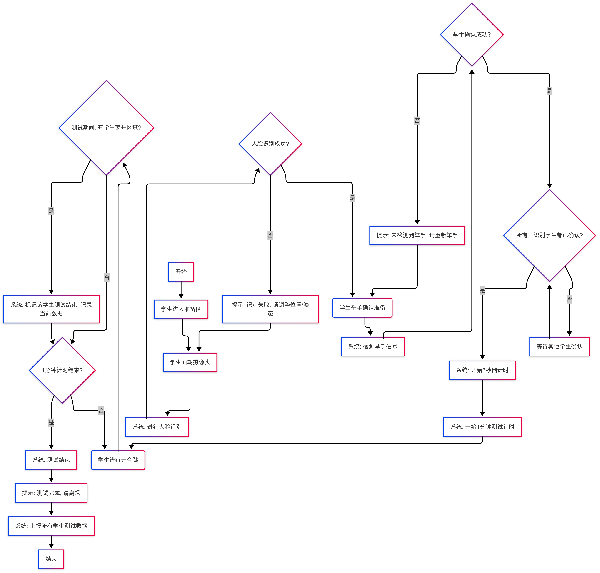

# 视觉AI多人开合跳检测系统用户手册

## 系统简介

视觉AI多人开合跳检测系统是一款通过人工智能视觉技术，同时监测多名学生开合跳运动表现的智能测评系统。该系统利用摄像头捕捉学生运动画面，自动识别面部、检测动作，并记录测试数据。

## 流程图

## 使用流程

### 1. 准备阶段

- **进入准备区**：学生有序进入摄像头前的指定准备区域
- **面部识别**：
  - 学生需面向摄像头，保持自然站姿
  - 系统将自动进行人脸识别
  - 若识别失败，请调整站位或姿态后重试

### 2. 确认准备

- **举手确认**：
  - 人脸识别成功后，学生需举手示意准备完毕
  - 系统将自动检测举手信号
  - 若未检测到举手信号，请重新举手
- **等待全员就绪**：
  - 系统将等待所有已识别学生完成举手确认
  - 请耐心等待其他同学完成准备

### 3. 测试执行

- **倒计时开始**：
  - 全员准备完毕后，系统自动开始5秒倒计时
  - 倒计时结束后，正式开始1分钟测试
- **执行开合跳**：
  - 学生在指定区域内进行开合跳运动
  - 系统会全程跟踪记录每位学生的表现

### 4. 测试结束

- **中途离场处理**：
  - 若有学生在测试期间离开测试区域，系统会自动标记该学生测试结束
  - 已记录的数据将被保存
- **时间结束**：
  - 1分钟计时结束后，系统提示测试完成
  - 所有学生请有序离场
- **数据上报**：
  - 系统自动上报所有学生的测试数据
  - 无需学生手动操作

## 注意事项

1. 测试过程中请保持在摄像头视野范围内
2. 穿着应与背景有足够对比度，便于系统识别
3. 测试区域应保持足够空间，避免互相干扰
4. 若系统提示识别失败，请调整站位后再次尝试
5. 全程遵循现场老师或管理员指导
